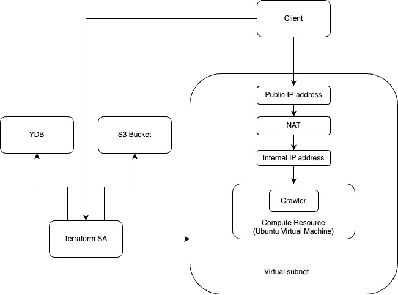

# Architecture

# Run
- create terraform.tfvars with specifying variables: folder_id, image_id (with crawler setup as in https://github.com/leapsky/bookspider), name_prefix (optional) 

- terraform plan

- terraform apply
