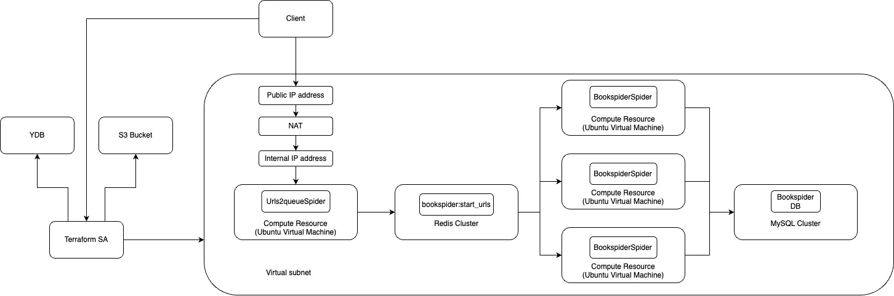

# Architecture

- client can create compute and network resources using Terraform service account
- terraform needs S3 Bucket and YDB to synchronize current configuration state 
- client can connect to VM via ssh using public IP address
- client can create MySQL cluster and start saving parsed data to the database using Terraform service account

# Run
- create terraform.tfvars with specifying variables: 
    - folder_id
    - image_id
    - zone (optional) 
    - ssh_key
    - user_name (optional)
    - db_user_name (optional)
    - db_user_pass
    - db_name (optional)
    - db_table_name (optional)

- terraform init

- terraform plan

- terraform apply
    - here the crawler starts saving parsed data to the database

- terraform destroy
